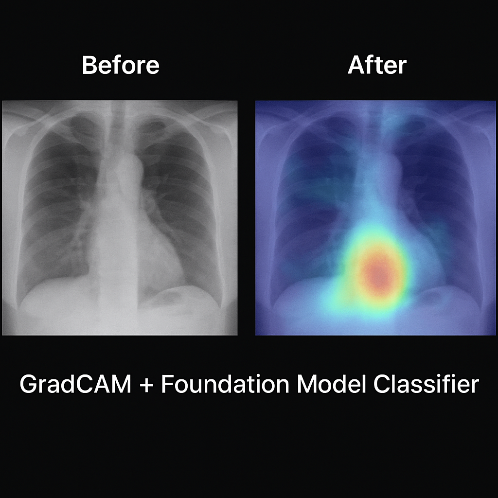

# 🧠 GradCAM + ResNet for Multi-Label Chest X-Ray Diagnosis

### A Visual Explanation Tool for Medical AI Models

> 🚀 Built with PyTorch, MedMNIST, and GradCAM — June 2025

[](LICENSE)
[](link-to-your-notebook)


---

## 📌 Overview

This project showcases a deep learning pipeline designed to classify chest X-ray scans using a convolutional neural network (ResNet-18) while offering explainable model insights through GradCAM visualizations.

Chest diseases like infiltration, pneumonia, and nodules often coexist in medical scans, requiring a **multi-label classification approach** rather than simple binary or multiclass prediction. This is addressed using the **ChestMNIST** dataset — a curated, medically annotated subset of the MedMNIST v2 collection — that consists of grayscale chest X-ray images labeled with up to 14 diagnostic tags per image.

Beyond classification, the key goal of this project is to make the model’s decisions **interpretable and trustworthy**. In high-stakes domains like healthcare, it's not enough for AI to be accurate — it must also be explainable. GradCAM (Gradient-weighted Class Activation Mapping) fills this gap by generating heatmaps over images to show **what parts of the input influenced the model’s prediction**.

This repo is intended for researchers, practitioners, and students interested in combining medical image classification with XAI (Explainable AI) techniques.

---

## 💡 Key Features

- 🧠 Trains a **ResNet-18 model** on ChestMNIST with multi-label binary cross-entropy loss
- 🧪 Performs evaluation on a test set with metrics like accuracy, AUROC, and loss
- 🔍 Visualizes GradCAM overlays to reveal regions the model deems important
- 🎥 Generates animated GIFs of raw vs. heatmapped predictions
- 📊 Clean, modular Jupyter notebooks for training and visualization

---

## 🔧 Tech Stack

- **Languages & Libraries**: Python, PyTorch, torchvision, timm, matplotlib
- **Data Source**: ChestMNIST via `medmnist` loader
- **Model**: Pretrained ResNet-18, adapted for 1-channel grayscale inputs
- **Visualization**: GradCAM (from [`pytorch-grad-cam`](https://github.com/jacobgil/pytorch-grad-cam)), image overlays, and animations
- **Environment**: Google Colab or local (CPU/GPU)

---

## 🎥 GradCAM in Action

<p align="center">
  
</p>

> These examples show how GradCAM overlays attention maps on top of chest X-rays, giving us a transparent look into model decisions.

---

## 🧪 How to Run

1. Clone the repository:
```bash
git clone https://github.com/aryanjain00/gradcam-chestxray
cd gradcam-chestxray
```

2. (Optional) Create a virtual environment:
```bash
conda create -n gradcam-env python=3.9
conda activate gradcam-env
```

3. Install dependencies:
```bash
pip install -r requirements.txt
```

4. Launch the Jupyter notebook:
```bash
jupyter notebook train_model.ipynb
```

Or run it fully in Google Colab using the button above ☝️

---

## 📁 Project Structure

```
├── train_model.ipynb         # Training pipeline
├── gradcam_visualizer.ipynb  # GradCAM generation notebook
├── assets/                   # Static images, GIFs, heatmaps
├── README.md                 # This file
└── requirements.txt          # Dependencies
```

---

## 📈 Model Results

After training for several epochs on a GPU-backed runtime:
- 🎯 Loss converges with multi-label BCE loss
- 📊 AUROC scores are strong across common diagnoses
- 🧠 Heatmaps from GradCAM correlate visually with visible anomalies in some test cases

This is intended as a **prototype and educational demo** — not a clinical-grade system.

---

## ⚕️ Real-World Use Case

Explainable deep learning is increasingly essential in healthcare, especially in radiology. A model that performs well but is a black box is difficult to trust in a clinical setting.

This workflow mimics what hospitals might eventually use:
- Input X-ray → Classifier → Prediction + Justification (via GradCAM)
- Human-in-the-loop validation by doctors
- Regulatory alignment through interpretability

---

## 🧑‍💻 Author

**Aryan Jain**  
M.Sc. Artificial Intelligence @ Deggendorf Institute of Technology  
📫 [LinkedIn](https://www.linkedin.com/in/aryan-jain-5b2634136/)  

---

## 📜 License

MIT License. You are free to fork, adapt, and build on top of this work — attribution appreciated.

---

**Built with ❤️ to support transparency in medical AI.**